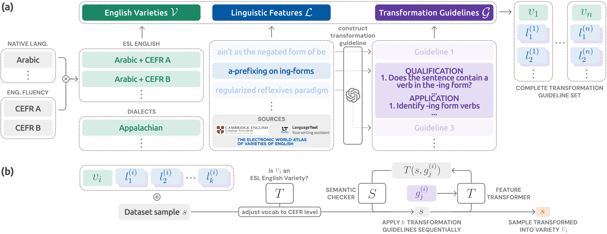
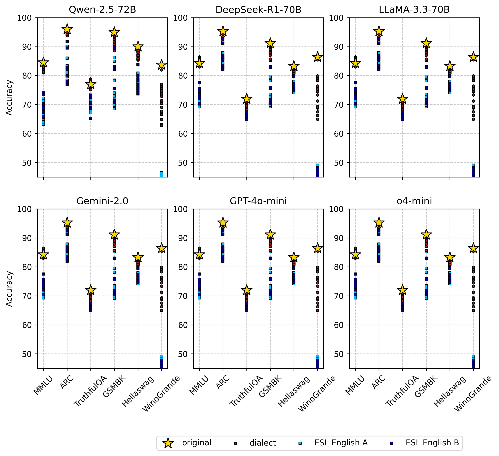

# A Framework for Evaluating the Linguistic Robustness of LLMs Against English Varieties
This repository is the official implementation of Trans-EnV.
<p align="center">
    
</p>

&nbsp;

&nbsp;


## Requirements 🛠️
To install requirements:
```bash
# PyTorch install (CUDA 12.1)
pip install torch==2.5.1 torchvision==0.20.1 torchaudio==2.5.1 --index-url https://download.pytorch.org/whl/cu121

# Requirements
pip install -r requirements.txt
```

Then, please set the necessary OS variables in your `.env` file.
```bash
GOOGLE_API_KEY=${GCP_API_KEY}  # For GCP Gemini API call
OPENAI_API_KEY=${OPENAI_API_KEY} # For OpenAI model API call
DATA_DIR=${HF_BENCHMARK_PATH}  # If you don't set, path will be set automatically `/home/${user}/.cache/huggingface`
MODEL_DIR=${HF_MODEL_PATH}  # If you don't set, path will be set automatically `/home/${user}/.cache/huggingface`
```

&nbsp;

&nbsp;


## Execution 🚀
### Trans-EnV
```bash
# Convert MMLU to ESL variety via Trans-EnV
python src/run/main.py --batch_size 15  --save_path ./outputs/mmlu/l1 --file_name A_arabic --l1 Arabic --task_name L1 --cefr_level A --port_num 6001 --dataset_name mmlu --model_name google/gemma-2-27b-it --tokenizer google/gemma-2-27b-it
```

&nbsp;

### LLM Evaluation for English Varieties
```bash
# LLM perforamnce evaluation for dialect variety of GSM8K
python src/run/benchmark_eval.py --model models/gemini-2.5-pro-preview-03-25 --data-path variety_examples/gsm8k/dialect/aave_rerun.csv --output-dir outputs

# LLM perforamnce evaluation for ESL (L1) variety of GSM8K
python src/run/benchmark_eval.py --model models/gemini-2.5-pro-preview-03-25 --data-path variety_examples/gsm8k/l1/A_arabic_rerun.csv --output-dir outputs
```

&nbsp;

&nbsp;


## Results 📚
Comprehensive summary of LLMs' performance across Standard American English (SAE) and 38 benchmark variants.
The results highlight that most LLMs perform best on tasks in SAE.
<p align="center">
    
</p>

&nbsp;

## License 🔑
This project is licensed under the [MIT License](LICENSE).
You are free to use, modify, and distribute this software with proper attribution.
