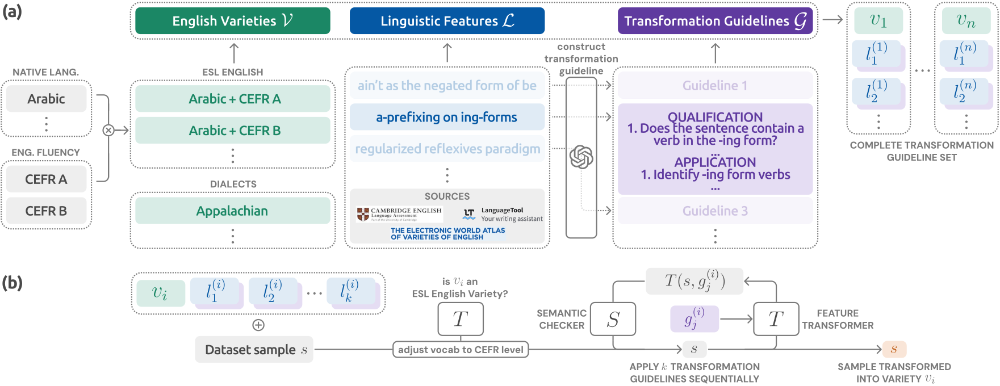
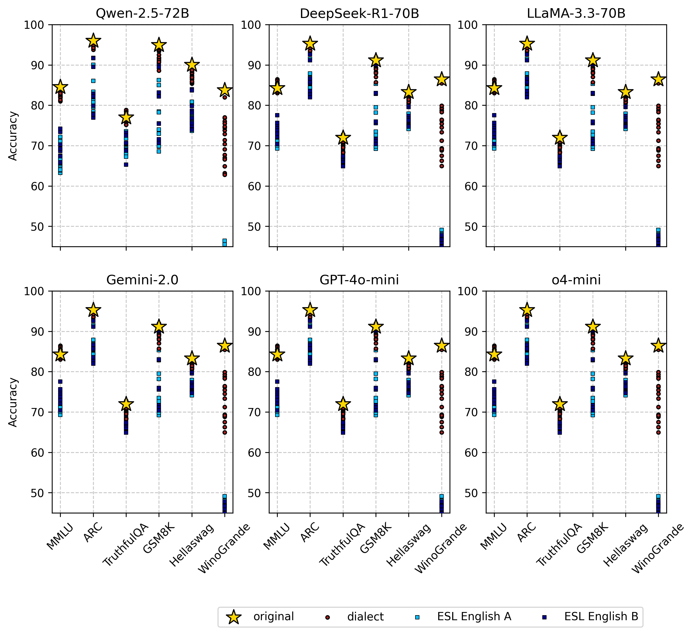

# Trans-EnV: A Framework for Evaluating the Linguistic Robustness of LLMs Against English Varieties

[](https://arxiv.org/abs/2505.20875)
[](https://huggingface.co/spaces/jiyounglee0523/Trans-EnV-demo)
[](LICENSE)

This repository is the official implementation of **Trans-EnV** ([paper](https://arxiv.org/abs/2505.20875), **NeurIPS 2025** Datasets and Benchmarks Track), a framework that transforms benchmarks written in Standard American English (SAE) into diverse English varieties to evaluate the linguistic robustness of LLMs.

<p align="center">
    
</p>

Trans-EnV covers **38 English variants** of each benchmark:

- **18 dialects** (AAVE, Scottish, Irish, Australian, …), driven by their linguistic features from [eWAVE](https://ewave-atlas.org/)
- **20 ESL learner varieties** — 10 native languages (Arabic, Chinese-Mandarin, French, German, Italian, Japanese, Portuguese, Russian, Spanish, Turkish) × CEFR proficiency levels A/B, combining CEFR grammar simplification (English Grammar Profile) with L1 grammar-transfer errors

&nbsp;

## Live Demo 🎛️

Try Trans-EnV interactively on Hugging Face Spaces — free ZeroGPU tier (no API key) or your own OpenAI / Gemini / Anthropic key:

**https://huggingface.co/spaces/jiyounglee0523/Trans-EnV-demo**

Type any SAE sentence, pick a variety (18 dialects, or ESL with L1 × CEFR level), and watch the guideline pipeline apply each linguistic rule live, with a semantic-preservation judge and a word-level diff of the result.

To run the demo locally:
```bash
pip install -r demo/requirements.txt
python demo/app.py          # http://localhost:7860  (add --share for a public link)
```
See [demo/README.md](demo/README.md) for details.

&nbsp;

## Requirements 🛠️

```bash
# PyTorch (CUDA 12.1)
pip install torch==2.5.1 torchvision==0.20.1 torchaudio==2.5.1 --index-url https://download.pytorch.org/whl/cu121

# Remaining dependencies
pip install -r requirements.txt
```

Then set the necessary variables in your `.env` file:

```bash
GOOGLE_API_KEY=${GCP_API_KEY}     # For GCP Gemini API calls
OPENAI_API_KEY=${OPENAI_API_KEY}  # For OpenAI model API calls
DATA_DIR=${HF_BENCHMARK_PATH}     # Defaults to /home/${USER}/.cache/huggingface
MODEL_DIR=${HF_MODEL_PATH}        # Defaults to /home/${USER}/.cache/huggingface
```

&nbsp;

## Execution 🚀

### Transforming a benchmark with Trans-EnV

```bash
# Convert MMLU to an ESL variety (CEFR level A, Arabic L1)
python src/run/main.py --batch_size 15 --save_path ./outputs/mmlu/l1 --file_name A_arabic \
    --l1 Arabic --task_name L1 --cefr_level A --port_num 6001 --dataset_name mmlu \
    --model_name google/gemma-2-27b-it --tokenizer google/gemma-2-27b-it
```

### Evaluating LLMs on English varieties

```bash
# LLM performance evaluation on the AAVE dialect variety of GSM8K
python src/run/benchmark_eval.py --model models/gemini-2.5-pro-preview-03-25 \
    --data-path variety_examples/gsm8k/dialect/aave_rerun.csv --output-dir outputs

# LLM performance evaluation on an ESL (L1) variety of GSM8K
python src/run/benchmark_eval.py --model models/gemini-2.5-pro-preview-03-25 \
    --data-path variety_examples/gsm8k/l1/A_arabic_rerun.csv --output-dir outputs
```

&nbsp;

## Repository Structure 📁

```
├── src/                  # Trans-EnV framework (transformation pipeline, benchmarks, evaluation)
├── assets/               # Guidelines, eWAVE features, CEFR grammar profile, vocab data
├── variety_examples/     # Pre-transformed GSM8K variants (18 dialects + 20 ESL varieties)
├── demo/                 # Interactive Gradio demo (local app + Hugging Face Space)
└── docs/                 # Figures
```

&nbsp;

## Results 📚

Comprehensive summary of LLM performance across Standard American English (SAE) and 38 benchmark variants.
The results highlight that most LLMs perform best on tasks in SAE.

<p align="center">
    
</p>

&nbsp;

## Citation 📝

If you find this work useful, please cite:

```bibtex
@article{lee2026trans,
  title={Trans-env: A framework for evaluating the linguistic robustness of llms against english varieties},
  author={Lee, Jiyoung and Kim, Seungho and Han, Jieun and Lee, Jun-Min and Kim, Kitaek and Oh, Alice and Choi, Edward},
  journal={Advances in Neural Information Processing Systems},
  volume={38},
  year={2026}
}
```

&nbsp;

## License 🔑

This project is licensed under the [MIT License](LICENSE).
You are free to use, modify, and distribute this software with proper attribution.
